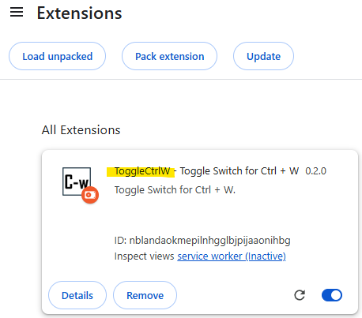
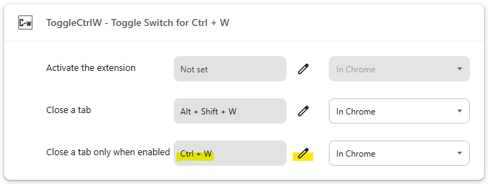

# ToggleCtrlW - Toggle switch for Ctrl + W

This chrome extension allows `Ctrl + W` to close tabs only as long as you
allow it.

Example of use: When operating a Linux terminal on the web, avoid closing
the browser tab when trying to erase a word with `C-w`.

## Requirements

- Google Chrome 128+

## Installation

Installation can be performed in a variety of ways:

- Download a zip from `https://github.com/kumarstack55/chrome-extension-toggle-ctrl-w/archive/refs/heads/main.zip` and unarchive it.
  - Example: Save unarchived files to `$HOME/chrome-extension-toggle-ctrl-w`.

- Open `chrome://extensions`.
  - Enable `Developer mode`, if not already enabled.
  - Click `Load unpacked`.
    - Example: Select the folder `$HOME/chrome-extension-toggle-ctrl-w-main/extension`

If loading is successful, the extension will be added to Chrome, and you will see the following icon in the toolbar.

- Open `chrome://extensions/shortcuts`.
  - Find `ToggleCtrlW - Toggle Switch for Ctrl + W`.
    - Find `Close a tab only when enabled`, and then click the pencil icon.
      - Type a shortcut: `Ctrl + W`

After setting, it will look like the following.

## Usage

By default, `Ctrl + W` will not close the tab.

1. Click Toggle switch icon from Extensions.
1. Enable only if you want to close a tab when you presses `C-w`.

## Contributing

This project is completely open source.
For more information, please refer to the following links:

https://github.com/kumarstack55/chrome-extension-toggle-ctrl-w

## TODO

- TODO: Notify when Ctrl + W is pressed.
- TODO: Install from Chrome Web Store

## License

MIT
